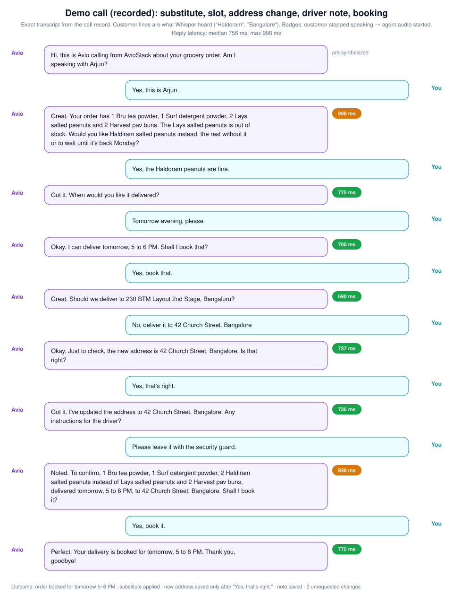
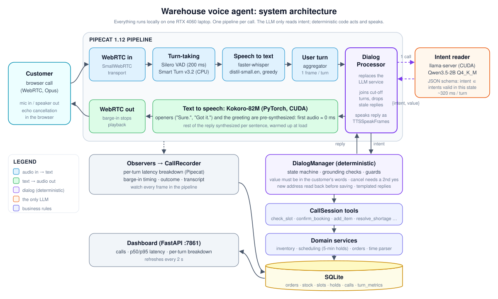
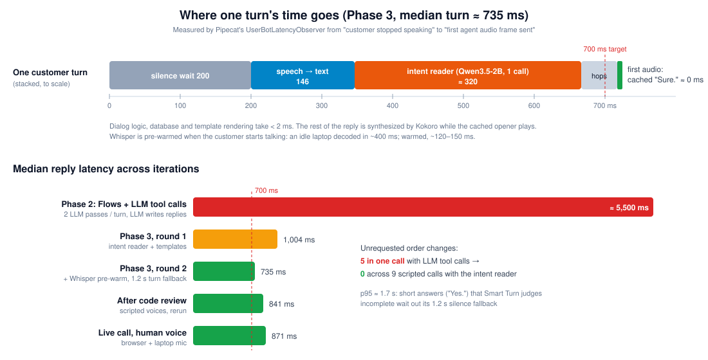
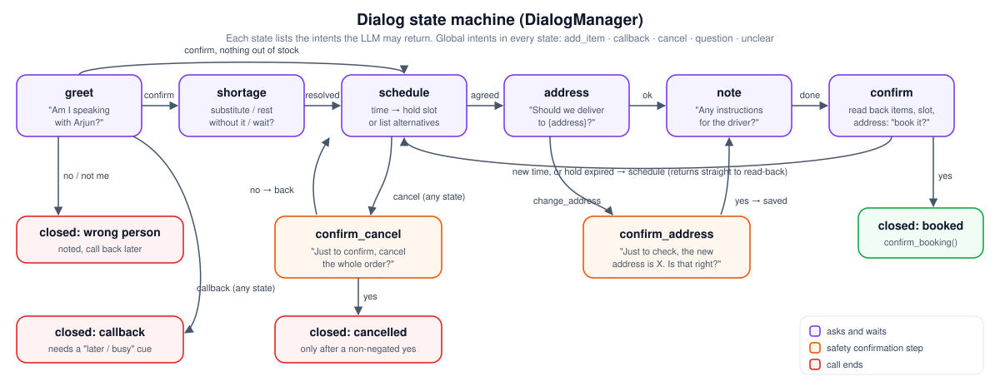

# Warehouse-voice-agent

**A fully local, low-latency voice agent that phones customers of a micro-warehouse grocery store about their order.** It confirms who it's talking to, walks through the items and anything out of stock, books a delivery slot from live capacity, confirms the address and driver instructions, and writes everything to a database.

It runs entirely on one laptop (RTX 4060, 8 GB) using only open-weight models. Nothing is sent to a paid API.

> *"Hi, this is **Avio** calling from **AvioStack** about your grocery order. Am I speaking with Arjun?"*

| | |
|---|---|
| **Median reply latency** (customer stops talking → agent starts talking) | **≈ 0.70–0.87 s** across scripted and live calls |
| **Greeting after the call connects** | **≈ 20–85 ms** (pre-synthesized) |
| **Order changes the customer didn't ask for** | **0** across all recorded calls (the first design made 5 in one call) |
| **Intent-reader accuracy** (48 labelled utterances) | **93.8 %**, 324 ms median, Qwen3.5-2B 4-bit |
| **Test suite** | 202 tests (domain, dialog, intent reader, pipeline glue, services, metrics) |
| **Cost** | ₹0. Every model is open-weight and runs locally. |

---

## Contents
1. [Demo](#1-demo)
2. [What the agent does](#2-what-the-agent-does)
3. [Architecture](#3-architecture)
4. [How one turn works (data flow)](#4-how-one-turn-works-data-flow)
5. [The dialog: why the LLM doesn't call tools](#5-the-dialog-why-the-llm-doesnt-call-tools)
6. [Business logic and data model](#6-business-logic-and-data-model)
7. [Model selection (benchmarks)](#7-model-selection-benchmarks)
8. [Results](#8-results)
9. [Repository structure](#9-repository-structure)
10. [Running it yourself](#10-running-it-yourself)
11. [Testing and measurement tools](#11-testing-and-measurement-tools)
12. [How the project evolved](#12-how-the-project-evolved)
13. [Limitations and next steps](#13-limitations-and-next-steps)

---

## 1. Demo

🔊 **[Listen to a recorded call (MP3, 2 min 11 s)](docs/demo/demo-call.mp3).** Both voices are mixed into one file. The agent is Avio. The customer lines are synthesized speech, sent to the agent over a real WebRTC connection by `scripts/scripted_call.py`.

This call shows:
- an out-of-stock item with the **closest substitute** offered
- a delivery slot **held from live capacity**
- an **address change read back before saving**
- a **driver note**
- the final **booking**



The transcript above comes straight from the call record. Speech recognition heard "Haldiram" as "Haldoram" and "Bengaluru" as "Bangalore", and the call still completed correctly. Every green badge is the measured time from the customer going quiet to the agent's audio starting.

---

## 2. What the agent does

The agent calls one customer about one pending order and guides the conversation through these steps:

1. **Identity.** "Am I speaking with Arjun?" If not → the call is marked *wrong person* and ends politely.
2. **Order and shortages.** It reads the order aloud. If an item is short, it offers: the most similar in-stock **substitute**, **the rest without it**, or **waiting for the restock** (with the restock day).
3. **Scheduling.** "When would you like it delivered?" The customer's words ("tomorrow evening", "after 6", "Friday afternoon", "the second one") are parsed by a rule-based time parser. The nearest free slot is **held for 5 minutes**; if the time is full, it offers the three nearest alternatives.
4. **Address.** "Should we deliver to …?" A new address is **read back and saved only after an explicit yes**.
5. **Driver instructions.** For example "leave it with the security guard".
6. **Read-back and booking.** "To confirm, …. Shall I book it?" On yes, the held slot is committed.

At any point the customer can **add an item** ("can you also add two Amul milk?", checked against live stock), **ask a question** ("how much is the total?"), ask for a **callback** ("I'm driving, call me later"), or **cancel** (which needs a second, explicit yes). They can also **interrupt** the agent mid-sentence: barge-in stops playback immediately.

---

## 3. Architecture



| Layer | Component | What it does |
|---|---|---|
| Transport | Pipecat `SmallWebRTCTransport` | Browser audio in and out. The prebuilt client is at `/client`, with echo cancellation in the browser. |
| Turn-taking | Silero VAD (200 ms silence) + **Smart Turn v3.2** (CPU, 8 MB ONNX) | Decides when the customer has *finished*, from the audio itself (intonation), so a pause mid-address isn't treated as the end of the turn. |
| Speech → text | **faster-whisper distil-small.en**, fp16, greedy (`GreedyWhisperSTTService`) | About 100–270 ms per utterance in calls. A throwaway decode **pre-warms** CTranslate2 when the customer starts speaking. |
| Dialog glue | `DialogProcessor` (sits where an LLM service normally sits) | One intent read per turn. Joins turns cut short by an interruption, drops replies that went stale, and recovers if an interruption brings no new words. |
| **The only LLM** | **Qwen3.5-2B Q4_K_M** on llama-server (CUDA) | Returns `{"intent", "value"}` only. A JSON schema limits `intent` to what is valid in the current state. |
| Dialog logic | `DialogManager` (pure Python) | State machine, grounding checks, safety guards, templated replies. |
| Business rules | `CallSession` → domain services → SQLite | Stock reservations, substitutions, 5-minute slot holds, booking, cancellation, callbacks. |
| Text → speech | **Kokoro-82M** (PyTorch, CUDA) | Openers ("Sure.", "Got it.") and the greeting are **pre-synthesized**, so first audio is effectively instant while the rest renders. |
| Observability | Pipecat `UserBotLatencyObserver`, a barge-in observer, `CallRecorder`, dashboard | Per-turn latency breakdown, barge-in timing, outcome and transcript in SQLite, and a live dashboard on `:7861`. |

---

## 4. How one turn works (data flow)



What happens between the customer finishing a sentence and hearing the agent:

1. **The customer stops talking.** Silero VAD waits **200 ms** of silence, then **Smart Turn** checks the last 8 s of audio and decides whether the turn is complete. If the model thinks it isn't (a trailing "and…"), the system waits up to 1.2 s more.
2. **Speech → text.** The audio segment goes to Whisper. It was already warmed when the customer *started* talking, so decoding takes about **150 ms**.
3. **The user aggregator** emits one context frame for the turn.
4. **`DialogProcessor`** collects every user message not yet answered (so "Saturday…" + "…at ten" become one turn) and calls the **intent reader**:
   ```
   system: <fixed prompt listing all intents>          ← identical every turn → llama.cpp prompt cache
   user:   AGENT: Should we deliver to 230 BTM Layout, Bengaluru?
           CUSTOMER: No, deliver it to 42 Church Street, Bangalore.
   schema: {"intent": enum[confirm, deny, change_address, add_item, callback, cancel, question, unclear], "value": str}
   →       {"intent": "change_address", "value": "42 Church Street, Bangalore"}        (~320 ms)
   ```
5. **`DialogManager.handle(intent, utterance)`** runs in under 2 ms. It:
   - rejects intents not allowed in this state
   - checks the value is **grounded** in the utterance (≥ 60 % of its content words were actually said)
   - applies the **guards**
   - calls `CallSession` tools, which call domain services that change SQLite inside transactions
   - returns template sentences, e.g. `["Okay.", "Just to check, the new address is 42 Church Street, Bangalore.", "Is that right?"]`
6. **Each sentence becomes a `TTSSpeakFrame`.** `"Okay."` is already synthesized, so it plays immediately while Kokoro renders the next sentence.
7. **Barge-in:** if the customer starts talking, Pipecat interrupts playback. A reply still being computed is dropped. The customer's new words are joined with the unanswered ones.

---

## 5. The dialog: why the LLM doesn't call tools



### What we tried first, and why it failed
Phase 2 used the standard pattern: **Pipecat Flows plus LLM function calling**, where the LLM chooses tools and writes replies. Live calls showed:
- **Invented actions:** Qwen3.5-2B added 2 sugar and 3 peanuts nobody asked for, and changed the address to a made-up one ([phase2-live-calls.md](docs/benchmarks/phase2-live-calls.md)).
- **About 5.5 s per reply:** one LLM pass to choose a tool, another to speak after the tool result, plus sentence-buffered TTS.

### What replaced it: the LLM reads intent, code acts and speaks
| Concern | How it's handled |
|---|---|
| The LLM taking actions nobody asked for | The LLM **can't act**. It only returns an intent label and the words that matter. Code decides what to do. |
| Intents that make no sense right now | A per-state JSON-schema enum. Anything else becomes `unclear`: "Sorry, I didn't catch that." |
| Invented arguments (a product, address or slot from the agent's own sentence) | **Grounding:** the value must appear in the customer's words, or the utterance itself is used instead. Quantities must be *said* (otherwise 1). |
| Destructive or irreversible actions | **Cancel** needs a second yes containing no negation ("no no, keep it" never cancels). A **new address** is read back and saved only on yes. A **callback** needs a real "not now" cue ("later", "busy", "driving"). Otherwise a delivery time stays a delivery time and a driver instruction stays a note. |
| Latency | One short LLM call (≈ 320 ms) per turn. Replies are templates, so there's no generation. Each reply starts with a cached opener. |
| Questions | Facts from the order (total, items, held slot). Anything off-topic gets a polite refusal. No free-form generation. |

### Intents per state
| State | The agent is waiting for | Intents allowed (plus global: `add_item`, `callback`, `cancel`, `question`, `unclear`) |
|---|---|---|
| `greet` | identity | `confirm`, `deny`, `wrong_person` |
| `shortage` | how to handle an out-of-stock item | `substitute`, `send_available`, `wait_restock`, `deny` |
| `schedule` | a time, or a yes to the held slot | `give_time`, `confirm`, `deny`, `pick_option` |
| `address` | address OK? | `confirm`, `deny`, `change_address` |
| `confirm_address` | "Is the new address X?" | `confirm`, `deny`, `change_address` |
| `note` | driver instructions | `confirm`, `deny`, `add_note`, `change_address` |
| `confirm` | final yes | `confirm`, `deny`, `give_time`, `change_address`, `add_note` |
| `confirm_cancel` | "cancel the whole order?" | `confirm`, `deny` |

---

## 6. Business logic and data model

The domain layer (`src/voiceagent/domain`, `src/voiceagent/db`) is plain Python over SQLite. It has no knowledge of the LLM or of audio, and it's covered by unit tests with a fixed clock.

```
warehouses(id, name, zone)
products(sku, name, spoken_name, category, unit_price)
stock(warehouse_id, sku, on_hand, reserved, restock_eta)          -- available = on_hand - reserved
customers(id, name, phone, default_address)
orders(id, customer_id, warehouse_id, status, address, notes, slot_id, callback_at, created_at)
order_lines(order_id, sku, qty, reserved_qty, substitute_sku, substitute_qty, resolution)
delivery_slots(id, warehouse_id, start_ts, end_ts, capacity, booked)
slot_holds(slot_id, order_id UNIQUE, expires_at)                 -- 5-minute holds, one per order
calls(id, order_id, started_at, ended_at, outcome, transcript_json)
turn_metrics(id, call_id, kind, total_ms, breakdown_json, recorded_at)   -- kind: response | greeting | barge_in
```

- **Slot holds:** a slot is held when offered and committed only on the final yes. Availability = capacity − booked − *other orders'* unexpired holds, so two simultaneous calls can't take the last seat.
- **Booking re-checks the restock date.** If the customer chooses "wait for restock" after a slot was held, a slot before the restock can't be booked.
- **Leaving `scheduled` frees the seat.** Callback, wrong person and cancel return booked seats and every stock reservation, substitutes included.
- **Time parser** (`timeparse.py`): handles "tomorrow after 5 p.m.", "half past five", "between 2 and 4", "Friday afternoon", "next Monday", "as soon as possible", and treats "the second one" as an ordinal, not 1 PM. Windows are clamped to delivery hours (08:00–21:00).
- **Substitutes** come from the same category, have enough stock, and are ranked by name similarity: *Lays salted peanuts* → *Haldiram salted peanuts* first.
- **Seed data** (`python -m voiceagent.db.seed`) generates a reproducible world: 50 products, 200 customers, 300 orders, 7 days of slots, and a deliberate share of shortages and full slots.

---

## 7. Model selection (benchmarks)

Every model was benchmarked on the target laptop before it was chosen. Full tables: [phase1-results.md](docs/benchmarks/phase1-results.md). The decision: [phase1-decision.md](docs/benchmarks/phase1-decision.md).

| Stage | Chosen | Measured | Rejected (why) |
|---|---|---|---|
| Speech → text | faster-whisper **distil-small.en** | WER 1.9 %, 98 ms p50, +585 MB | Nemotron streaming 0.6B (WER 6 %, 171 ms, 2.5 GB); Parakeet TDT v2 on CPU (400 ms) |
| End of turn | **Smart Turn v3.2** (CPU) | 61 ms p50 | — (v3.2 handles short answers best of the open options) |
| LLM | **Qwen3.5-2B Q4_K_M** | intent read 324 ms p50, 93.8 % accuracy | Qwen3-4B-2507 (89.6 %, same speed, 7.6 GB peak); Qwen3.5-4B (slower) |
| Text → speech | **Kokoro-82M, PyTorch** | ≈ 395 ms per first clause (hidden by cached openers) | kokoro-onnx (612 ms: STFT falls back to the CPU in ONNX Runtime) |

**Hardware finding: the Windows driver taxes small GPU operations.**
- On this laptop, Windows' WDDM GPU driver adds about **48 µs to every CUDA kernel launch**, while the GPU itself does 28 fp16 TFLOPS.
- Models that run thousands of tiny kernels (Kokoro, streaming ASR) pay heavily for this. That's why the design pre-synthesizes openers and pre-warms Whisper.
- Separately, after a few idle seconds an idle laptop decoded in about 400 ms instead of about 120 ms. A throwaway decode at speech start fixes it.

**Fine-tuning was evaluated and deliberately deferred:**
- Every remaining intent miss of the 2B model is either harmless or caught by a deterministic guard.
- The 4B model was *worse*.
- 48 labelled utterances is too small a set to fine-tune on without overfitting.
- The evaluation harness (`bench/intent_eval.py`) is ready for when real call transcripts show systematic errors.

---

## 8. Results

### Latency (customer stops talking → first agent audio)
| Run | Calls | Median | p95 |
|---|---|---|---|
| Phase 2: Flows + LLM tool calls | 1 scripted | ≈ 5,500 ms | — |
| Phase 3 round 1: intent reader + templates | 3 scripted | 1,004 ms | 3,742 ms |
| Phase 3 round 2: + Whisper pre-warm, 1.2 s turn fallback | 3 scripted | **735 ms** | 1,769 ms |
| After code review | 3 scripted | 841 ms | 1,757 ms |
| **Live call, human voice** (browser + laptop mic) | 1 | **871 ms** | — |
| Demo call above | 1 scripted | **756 ms** | 998 ms |

Typical breakdown, from Pipecat's latency observer:
- 200 ms silence wait (VAD)
- ~150 ms speech → text
- ~320 ms intent reader
- ~60 ms pipeline hops
- **~0 ms first audio** (cached opener)

**p95 outliers (~1.7 s)** are short answers like "Yes." that Smart Turn judges incomplete; they wait out its 1.2 s silence fallback.

### Correctness
- **0 order changes the customer didn't ask for** across 9 scripted calls plus the demo. The Phase 2 design made 5 in one call.
- **Every safety rule has a regression test,** 202 tests in total. Examples:
  - "No no, keep it" never cancels.
  - An address misheard by speech recognition is never saved without a yes. This was found in a live test call and fixed.
  - A quantity copied from the agent's sentence is ignored.
  - "The second one" picks the second offered slot, not 1 PM.
  - A turn cut off by an interruption is not lost.

### Intent reader (48 labelled utterances, `bench/intent_eval.py`)
| Model | Accuracy | Value matches label | Latency p50 / p95 |
|---|---|---|---|
| **Qwen3.5-2B Q4_K_M** | **93.8 %** | 97.9 % | 324 / 435 ms |
| Qwen3-4B-Instruct-2507 Q4_K_M | 89.6 % | 100 % | 321 / 437 ms |

Details and every remaining miss: [phase3-dialog-calls.md](docs/benchmarks/phase3-dialog-calls.md).

---

## 9. Repository structure

```
src/voiceagent/
├── agent/                       # the live voice agent
│   ├── bot.py                   # Pipecat pipeline wiring + runner entry point (python -m voiceagent.agent.bot)
│   ├── processor.py             # DialogProcessor: one intent read per turn, interruption-safe, speaks the reply
│   ├── intent.py                # IntentClassifier: the single LLM call (JSON-schema-constrained)
│   ├── dialog.py                # DialogManager: states, grounding, guards, templated replies
│   ├── nlu.py                   # grounded(), said_number(), split_quantity()
│   ├── tools.py                 # CallSession: JSON-returning tools over the domain services (+ audit logging)
│   ├── services.py              # GreedyWhisperSTTService (pre-warm), KokoroTorchTTSService (cache), Smart Turn
│   ├── metrics.py               # CallRecorder, BargeInObserver, latency breakdown → SQLite
│   └── dashboard.py             # FastAPI dashboard on :7861
├── domain/                      # business rules, no audio, no LLM
│   ├── models.py                # dataclasses, delivery hours, open-order statuses
│   ├── timeparse.py             # spoken time → delivery window
│   ├── inventory.py             # lookup, shortages, substitutes, add item, partial, wait
│   ├── scheduling.py            # free slots, 5-minute holds, booking
│   ├── orders.py                # cancel, address, notes, callback, wrong person
│   └── context.py               # pre-call facts + spoken formatting ("tomorrow, 5 to 6 PM")
└── db/
    ├── schema.sql               # tables above
    ├── repository.py            # the only module with SQL; thread-safe transactions
    └── seed.py                  # reproducible synthetic warehouse world

bench/                           # measurement harnesses (results committed in bench/results/)
├── stt_bench.py · turn_bench.py · tts_bench.py · llm_bench.py   # Phase 1 model benchmarks
├── intent_eval.py               # intent reader accuracy + latency
├── corpus/phrases.json          # 65 benchmark utterances; intent_cases.json: 48 labelled turns
├── make_corpus.py · record_corpus.py   # synthesize / record the audio corpus
└── report.py                    # results → docs/benchmarks/phase1-results.md

scripts/
├── scripted_call.py             # WebRTC test caller: speaks scripted lines, records, mixes an MP3
├── download_models.py · get_llama_cpp.sh · llama_server.sh
├── chat_templates/qwen3.5-multi-system.jinja   # template patch for llama-server
└── smoke_tts.py

tests/                           # 202 tests: domain/, agent/, bench/
docs/
├── specs/                       # design spec
├── superpowers/plans/           # the implementation plans each phase was built from
├── benchmarks/                  # phase 1–3 results and decisions
├── assets/                      # the SVG diagrams in this README
└── demo/demo-call.mp3           # recorded demo call
stt_inference/, quant.py         # the original prototypes this project started from
```

---

## 10. Running it yourself

**You need:** Windows 10/11 with an NVIDIA GPU (8 GB+), Python **3.11**, Git Bash, and about 10 GB of disk for models.

```bash
# 1. environment
py -3.11 -m venv .venv
.venv/Scripts/python -m pip install torch --index-url https://download.pytorch.org/whl/cu128
.venv/Scripts/python -m pip install -e ".[dev,bench,agent]"

# 2. models + llama.cpp (CUDA build)
.venv/Scripts/python scripts/download_models.py
bash scripts/get_llama_cpp.sh

# 3. data
.venv/Scripts/python -m voiceagent.db.seed --db data/warehouse.db
```

**Start a call** (three terminals):
```bash
bash scripts/llama_server.sh models/llm/Qwen3.5-2B-Q4_K_M.gguf          # 1: intent reader
.venv/Scripts/python -m voiceagent.agent.bot -t webrtc --order-id 2     # 2: the agent
.venv/Scripts/python -m voiceagent.agent.dashboard                      # 3: optional, http://localhost:7861
```

Open **http://localhost:7860/client**, click **Connect**, allow the microphone, and **use headphones** (otherwise the agent hears itself). Each order id is a different customer and order; orders with shortages are a good test.

> **PowerShell:** use `.\.venv\Scripts\python.exe` instead of `.venv/Scripts/python`, and run the commands from the repo folder. PowerShell shows Python's log output in red; that's normal.

**Settings that matter:**

| Where | Setting | Default | Effect |
|---|---|---|---|
| `bot.py` | `VADParams(stop_secs=…)` | 0.2 s | silence before turn analysis |
| `services.make_turn_analyzer` | `SmartTurnParams(stop_secs=…)` | 1.2 s | max wait when a turn looks unfinished |
| `dialog.py` | `AGENT_NAME`, `COMPANY`, `ACKS` | Avio, AvioStack | persona and cached openers |
| `nlu.grounded` | `min_share` | 0.6 | how much of a value must be the customer's own words |
| `processor.DialogProcessor` | `recovery_secs` | 2.5 s | answer a pending turn after an interruption that brought no new words |

---

## 11. Testing and measurement tools

```bash
.venv/Scripts/python -m pytest                                  # 202 tests, ~15 s, no GPU needed
.venv/Scripts/python -m bench.intent_eval --model-name qwen3.5-2b-q4km   # needs llama-server
.venv/Scripts/python scripts/scripted_call.py --url http://localhost:7860/api/offer \
    --mix-out call.mp3 --duration 120 "20:Yes, speaking." "34:Tomorrow evening." "48:Yes, book that."
```

- **Unit tests** run every dialog path against an in-memory database with a fixed clock. The intent reader is tested against mocked HTTP. Pipeline glue is tested with Pipecat's `run_test`.
- **The scripted caller** dials the agent over real WebRTC, exactly like the browser. It speaks Kokoro-synthesized customer lines on a schedule and writes a two-voice MP3.
- **The dashboard and `turn_metrics`** give the per-turn latency breakdown (silence wait, transcription, turn detection, intent read, TTS) for every real call.
- **Phase 1 benchmarks** (`bench/*_bench.py`) re-measure each model on new hardware.

---

## 12. How the project evolved

| Phase | What was built | What we learned |
|---|---|---|
| **1. Foundation** ([plan](docs/superpowers/plans/2026-10-09-foundation.md)) | Domain layer, seed data, benchmark harness | Whisper beat the streaming ASR models on this hardware. The Windows WDDM launch overhead makes TTS the bottleneck. No LLM was trustworthy without tools. |
| **2. Live pipeline** ([plan](docs/superpowers/plans/2026-10-09-voice-pipeline.md)) | Pipecat, Flows, tool calling, recording, dashboard | The pipeline worked end to end, but the 2B model invented tool calls and replies took about 5.5 s. A scripted WebRTC test caller caught 7 runtime bugs unit tests couldn't. |
| **3. Intent-reader redesign** ([plan](docs/superpowers/plans/2026-10-09-dialog-manager.md)) | LLM as intent reader, deterministic dialog, grounding and guards, cached openers, Whisper pre-warm | 0 unrequested changes; median reply 5.5 s → ~0.75 s. An independent code review found 9 more edge cases (all fixed with tests). A live human call found the misheard-address bug (fixed: read-back before save). |

The design spec ([docs/specs](docs/specs/2026-10-09-voice-caller-agent-design.md)) records each decision and why it changed.

---

## 13. Limitations and next steps

- **Latency** is just over the 700 ms median target. Next levers:
  - End the turn immediately when the dialog expects a short answer and the transcript is one ("yes", "book it"). That removes the ~1.7 s p95 cases.
  - Start the intent reader while Smart Turn is still deciding, instead of after it.
- **Speech recognition with Indian-accented English** mishears brand names and some words ("Haldoram", "Bangalore", "Amel milk"). The dialog design makes this safe (grounding, read-backs, guards), but not error-free. Options: hotwords for the product catalogue, or a larger Whisper model if latency allows.
- **Evaluation** covers 48 labelled utterances and scripted calls. A larger set from real human calls would show whether fine-tuning the intent reader is worth it.
- **Telephony:** calls are browser WebRTC. A SIP/PSTN path (Asterisk with Pipecat's serializer) is the next transport.
- **Small follow-ups:**
  - Answering "yes" to "Any instructions?" doesn't ask what they are.
  - If llama-server goes down, the call doesn't escalate.
  - If a GPU model fails to load at startup, the call row is left open.

---

<sub>Built with Pipecat, faster-whisper, Smart Turn, Silero VAD, llama.cpp, Qwen3.5 and Kokoro. All open-weight and all running locally.</sub>
